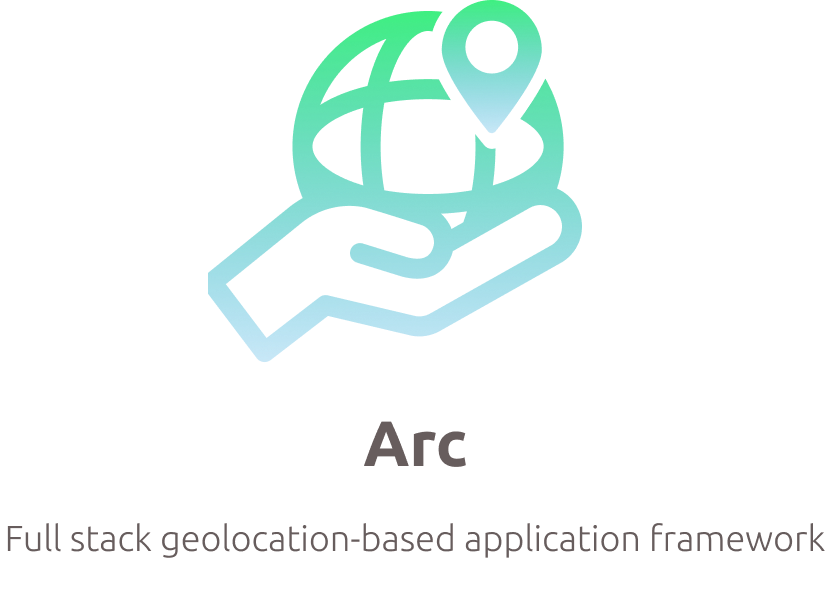

## Prepare

- docker, docker-compose
- bazel
- Go
- mysqldef

これらのツールを下記の手順と注意事項に従ってインストールしてください

### Docker and Docker compose
https://docs.docker.com/docker-for-mac/install/

上記のインストール手順に従いインストールしてください.
Docker for Desktopをインストールすればdocker cli, docker-compose
も同時にインストールされます

### Bazel
bazelは本来ビルドツールですが，grpcのコード生成に用いています.
現状1.0がリリースされていますが，検証環境では0.26を使用しています.

1.0でworkspaceに定義されたプラグイン等が動作するかは未確認です.

https://docs.bazel.build/versions/master/install.html

インストール手順が上記のサイトを参考にしてください

### Go
全てのコンポーネントがGo言語で実装されています.

各種コンポーネントをビルド, 起動する際にはGo言語のコードをコンパイルする必要があります.

https://tecadmin.net/install-go-on-macos/

想定環境は `Go ver 1.11以上` です.
古いGoだと Go modulesの機能がなく, library周りをインポートできない可能性があります

### mysqldef
mysqlのマイグレーションにはmysqldefを用いてsqlを適用していきます
下記のサイトを参考にインストールしてください

https://github.com/k0kubun/sqldef