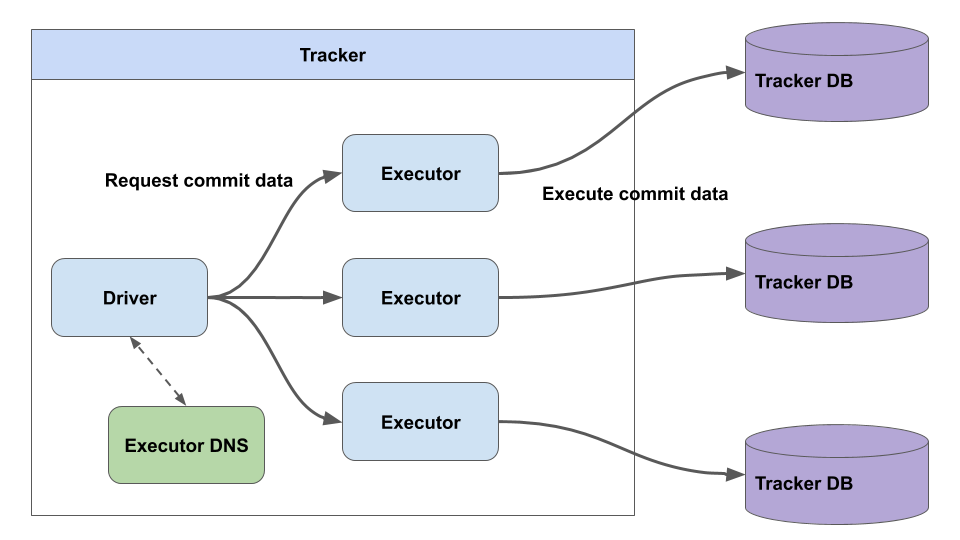

# TXM
Transaction Manager(TXM)

<!-- vscode-markdown-toc -->
* 1. [Why](#Why)
* 2. [How](#How)
	* 2.1. [Executor](#Executor)
	* 2.2. [Driver](#Driver)
	* 2.3. [Executor DNS](#ExecutorDNS)
* 3. [API](#API)
	* 3.1. [Driver](#Driver-1)
		* 3.1.1. [Put Information](#PutInformation)
		* 3.1.2. [Look Up Peer](#LookUpPeer)
	* 3.2. [Executor](#Executor-1)
		* 3.2.1. [Prepare put peer request](#Prepareputpeerrequest)

<!-- vscode-markdown-toc-config
	numbering=true
	autoSave=true
	/vscode-markdown-toc-config -->
<!-- /vscode-markdown-toc -->

##  1. <a name='Why'></a>Why
ピアの地理情報の管理, 検索における負荷はピアの数により線形に増加する.
これに対応するためにはスケールアウトをサポートしなくてはならない.
地理情報をDBでスケールアウトさせるのはパーティショニングによりDBを分割させるのが一番であるが,
MySQLやPostgresqlは地理情報用の型をパーティショニングできるようには実装していない(2020/1/14現在).

つまり, アプリケーションレベルで地理情報をベースとしたパーティショニングを行う必要がある.
この文脈におけるパーティショニングとは地理情報からGeoHash, H3等の空間充填曲線による空間インデックスをそれぞれのDBに割り当て, ピアの情報を書き込む, 読み込むデータベースを空間インデックスから選択することである.

##  2. <a name='How'></a>How
DBの負荷分散は複数のDBにラッパーとなるAPIを立て, それらを統括するAPIを介して実現する.
以下の図がTXMの全体図である.



###  2.1. <a name='Executor'></a>Executor
ExecutorはDBへの書き込み, 読み込みを行うラッパーである.
Executorは全て独立しており, 個々のExecutor同士の実行タスクは依存しない.

バックエンドにDatabaseを持っており, 地理情報(空間インデックス)のパーティショニングにより別れている.
つまり, 同一のピアの情報が複数のExecutorを介して同時に登録されることはない.

###  2.2. <a name='Driver'></a>Driver
Driverは複数のExecutorに跨るピアの検索や, 空間インデックスとそれを担当するExecutorの対応づけなどを行う.
Gatewayに投げられたユーザからのタスクはDriverが実質的に処理してその結果を返す.

###  2.3. <a name='ExecutorDNS'></a>Executor DNS
Driverが複数の空間インデックスに跨るピアの検索を行う場合,
そのインデックスをどのExecutorおよびDBが担当しているかを解決する必要がある.

Executor DNSは空間インデックスを鍵としてExecutorのアドレスを名前解決するKVSである.

##  3. <a name='API'></a>API
それぞれのコンポーネントはRESTful APIとして実装されているので,
各APIのインターフェースを述べる

###  3.1. <a name='Driver-1'></a>Driver

####  3.1.1. <a name='PutInformation'></a>Put Information
ピアの登録, 更新を行う.

- PUT: `/api/peer`
- POST: `/api/peer`

**Request Body**
```
curl -XPOST "http://localhost:8000/api/peer" -d \
'{
	"idempotency_key": "aaaa",
    "peer_id": "aaaa",
	"addr": "127.0.0.1:8080",
	"credential": "xxxx",
    "longitude": 127.00000,
    "latitude": 35.0000000
}'
```

####  3.1.2. <a name='LookUpPeer'></a>Look Up Peer
ピアの検索

- GET: `/api/v1/peer`

**Request Body**
```
{
    "radius": 500,
    "longitude": 124.00000,
    "latitude": 35.000000
}
```

radiusの単位はkm

###  3.2. <a name='Executor-1'></a>Executor

####  3.2.1. <a name='Prepareputpeerrequest'></a>Prepare put peer request

**Request Body**
```
curl -XPOST "http://localhost:8000/api/peer/prepare" -d \
'{
	"idempotency_key": "xxxx",
    "peer_id": "aaaa",
	"addr": "127.0.0.1:8080",
	"credential": "xxxx",
    "longitude": 127.00000,
    "latitude": 35.0000000
}'
```

##### Commit put peer request
```
curl -XPOST "http://localhost:8000/api/peer/commit" -d \
'{
	"idempotency_key": "xxxx"
}'
```